# 🔍 Détection de fraude documentaire — Dossiers de crédit

> Système **multi-signaux** de détection de fraude sur des dossiers de demande de crédit marocains : **règles métier + base de graphe + LLM + vision par ordinateur (GANomaly)**, fusionnés par une régression logistique calibrée.

Projet réalisé chez **PEAQOCK** dans le cadre du stage PFA — ENSAM Casablanca, Département IA & Génie Informatique (2025–2026).

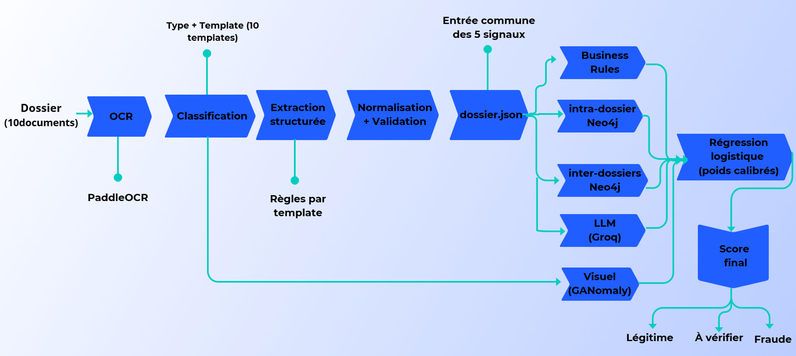

---

## 📌 Contexte

La vérification manuelle des pièces justificatives d'un dossier de crédit est exposée à plusieurs formes de fraude : falsification visuelle, incohérences entre documents, réutilisation d'identités ou de RIB, incohérences sémantiques (poste / employeur / salaire).

Aucune méthode seule ne couvre tous ces cas. Le projet répond à la question :

> *Comment détecter différentes formes de fraude documentaire en combinant plusieurs sources d'information complémentaires, tout en limitant la dépendance aux données frauduleuses labellisées ?*

Un dossier = **10 documents** : CIN, quittance (Lydec, Amendis, Maroc Telecom), RIB (CIH / Attijariwafa), 3 relevés bancaires, 3 bulletins de salaire, attestation de travail — soit **10 gabarits** pris en charge.

---

## ⚙️ Fonctionnement

1. **OCR** (PaddleOCR) avec reconstruction spatiale (lignes / colonnes)
2. **Classification** du type de document et du gabarit (recalage ECC)
3. **Extraction structurée** par règles, spécifiques à chaque gabarit
4. **Normalisation + validation** des champs
5. Construction de **`dossier.json`** (entrée commune des 5 signaux)
6. Chargement dans **Neo4j**
7. Calcul des **5 signaux** de fraude
8. **Fusion** par régression logistique (poids calibrés)
9. **Verdict** : validation automatique / vérification complémentaire / escalade analyste

---

## 🧠 Les 5 signaux

| # | Signal | Principe | Fichier |
|---|--------|----------|---------|
| 1 | **Règles métier** | 7 règles déterministes : 3 bulletins consécutifs, salaire vs virement, totaux et soldes des relevés, cohérence de l'employeur… Score binaire, règle violée conservée comme justification ..ect| `signals/business_rules_signal.py` |
| 2 | **Cohérence intra-dossier** (Neo4j) | Nom, CIN, RIB, IBAN, adresse cohérents entre tous les documents du dossier ..ect | `signals/intra_dossier_signal.py` |
| 3 | **Cohérence inter-dossiers** (Neo4j) | Même CIN avec noms différents, RIB/IBAN partagés entre identités, même nom avec plusieurs CIN ..ect | `signals/inter_dossier_signal.py` |
| 4 | **Analyse sémantique** (LLM via Groq) | Le LLM ne renvoie que des anomalies qualifiées (faible → très forte) ; le score est calculé de façon déterministe : `1 − ∏(1 − pᵢ)` → reproductible | `signals/llm_signal.py` |
| 5 | **Analyse visuelle** (GANomaly, PyTorch) | Un modèle par gabarit, entraîné **uniquement sur des documents authentiques** ; score local par patch (4 px), seuil de Youden, profil normal par position (z-score) | `signals/visual_signal_1.py` |

### Exemple de graphe Neo4j

Chaque dossier est modélisé comme un graphe : un nœud `Dossier`, relié à ses 10 nœuds `Document` (relation `CONTIENT`), eux-mêmes reliés à leurs champs extraits, les nœuds `Champ` (relation `POSSEDE`). Le graphe ci-dessous correspond à un seul dossier : 1 dossier, 10 documents, 112 champs.

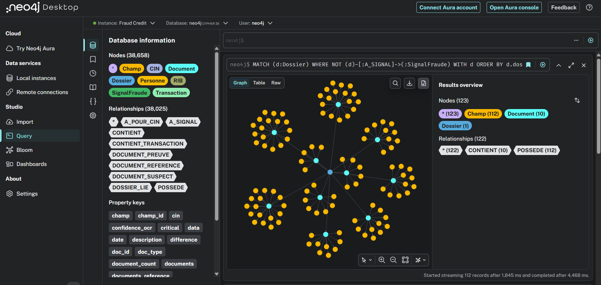

Ce modèle permet de retrouver facilement un CIN, un RIB ou un IBAN partagé entre plusieurs dossiers.

### Poids appris par la régression logistique

| Signal | Poids |
|--------|------:|
| Cohérence intra-dossier | 25,5 % |
| Règles métier | 20,3 % |
| Analyse visuelle | 20,3 % |
| Cohérence inter-dossiers | 17,7 % |
| Analyse sémantique | 16,3 % |

### Niveaux de décision

| Score final | Décision |
|-------------|----------|
| `< 0,024` | ✅ `VALIDATION_AUTOMATIQUE` |
| `0,024 – 0,046` | 🟠 `VERIFICATION_COMPLEMENTAIRE` |
| `≥ 0,046` | 🔴 `ESCALADE_ANALYSTE` |

Poids et seuils sont stockés dans `poids_calibration.json`.

---

## 📊 Résultats

Évaluation sur un jeu de test **jamais utilisé** pour entraîner la régression logistique (split stratifié 80/20) :

| Precision | Recall | F1-score | ROC-AUC |
|:---------:|:------:|:--------:|:-------:|
| 0,93 | **1,00** | 0,96 | **0,99** |

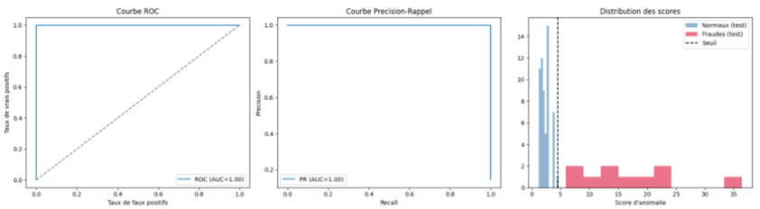

**Signal visuel (GANomaly)** — performance par gabarit (un modèle entraîné par gabarit) :

| Gabarit | Precision | Recall | F1 | ROC-AUC |
|---------|:---------:|:------:|:--:|:-------:|
| Bulletin de salaire | 1,00 | 1,00 | 1,00 | 1,00 |
| Attestation de travail | 1,00 | 0,90 | 0,95 | 1,00 |
| Relevé Attijariwafa | 1,00 | 0,91 | 0,96 | 1,00 |
| Quittance | 0,91 | 1,00 | 0,95 | 1,00 |
| RIB Attijariwafa | 0,75 | 0,90 | 0,82 | 0,97 |
| Relevé CIH | 0,67 | 1,00 | 0,85 | 0,98 |
| RIB CIH | 0,67 | 1,00 | 0,80 | 0,97 |
| CIN | 0,88 | 0,70 | 0,78 | 0,94 |

Le détail de la mise au point du signal visuel est présenté dans la section suivante.

---

## 🔬 Mise au point du signal visuel

Le signal visuel est celui qui a demandé le plus d'efforts. La configuration finale résulte d'une démarche **diagnostique itérative** : chaque étape est née d'un problème observé à l'étape précédente.

| Étape | Changement | Problème résolu | Résultat observé |
|:-----:|-----------|-----------------|------------------|
| 1 | **Score global** (erreur de reconstruction moyenne sur toute l'image) | — | Recall ≈ **0 %** : les altérations locales sont diluées dans la moyenne |
| 2 | **Score local par patch** (16 px) | Cibler la zone falsifiée au lieu de l'image entière | 2 fraudes sur 3 détectées |
| 3 | **Recherche de la taille de patch optimale** | Patch de 16 px encore trop grossier | Patch de **4 px** retenu, recall ≈ **70 %** |
| 4 | **Seuil F1 → indice de Youden** | Le seuil F1 provoquait une sur-détection généralisée | Meilleure séparation entre cas normaux et suspects |
| 5 | **Profil normal par position + z-score** | QR codes et tampons produisent une forte erreur même sur des documents authentiques | Réduction du bruit lié aux zones structurelles |

### Du score global au score par patch

À gauche, le score global : le bruit est partout et la falsification est noyée. À droite, le score local par patch : seules les zones réellement suspectes ressortent.

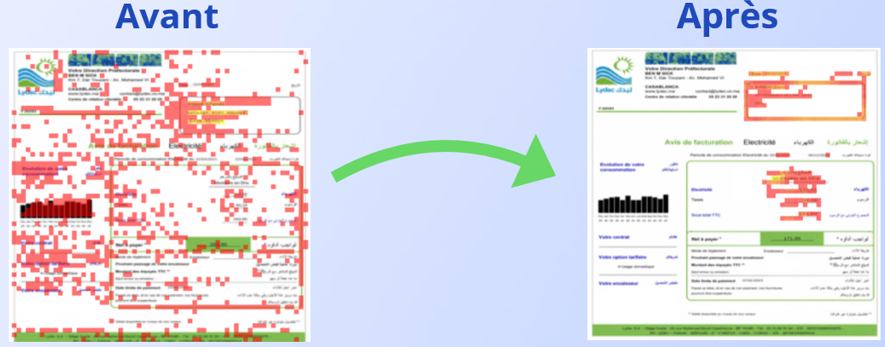

### Phase de warm-up du GANomaly

L'entraînement adversarial est stabilisé par une **phase de warm-up** : le générateur apprend seul à reconstruire les documents authentiques avant l'introduction du discriminateur. Sans cela, le discriminateur écrase l'apprentissage du générateur trop tôt.

Sans warm-up, la reconstruction est floue et peu exploitable. Avec warm-up, elle est nettement plus nette et plus fidèle à l'original, et les courbes de perte sont plus stables.

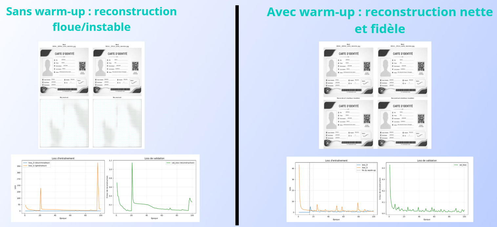

### Étude d'ablation : ce qui compte le plus

- **Score par patch** : le choix le plus déterminant (sans lui, recall à 0 %).
- **Taille de patch** : deuxième gain majeur (recall de ≈ 20 % avec des tailles sous-optimales à ≈ 70 % avec 4 px).
- **Indice de Youden** : pas de gain visible sur les métriques ponctuelles, mais indispensable en pratique pour éviter une dérive vers une classification quasi systématique « suspect ».
- **Profil normal par position (z-score)** : moins de faux positifs sur les éléments structurels récurrents.

---

## 🖥️ Interface de démonstration

L'interface Streamlit affiche le score final, la contribution de chaque signal, les anomalies détectées et une **heatmap de suspicion** sur les documents visuellement suspects.

| Dossier légitime | Dossier frauduleux |
|:---:|:---:|
| 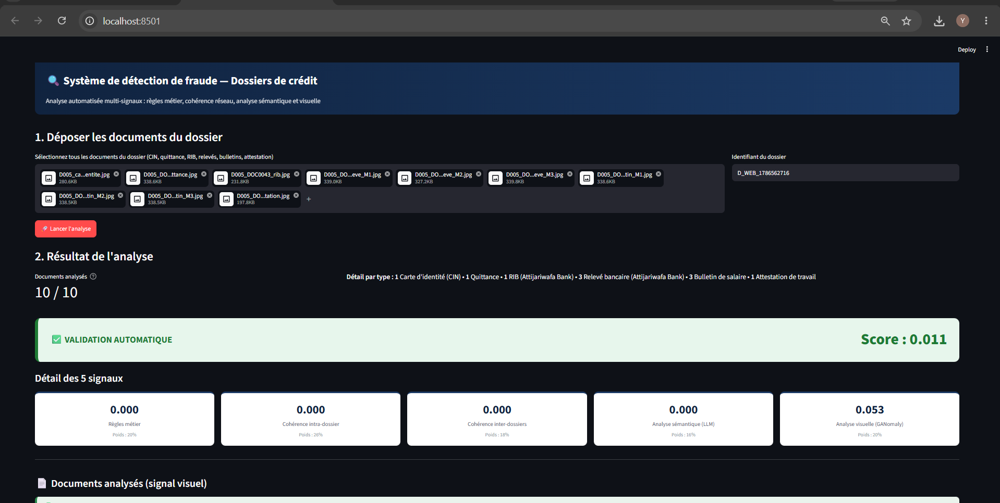 | 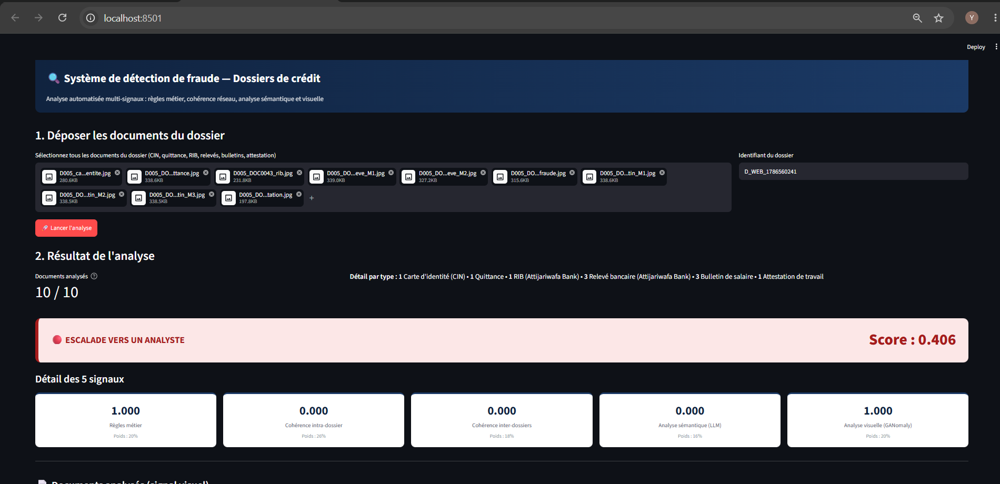 |
| 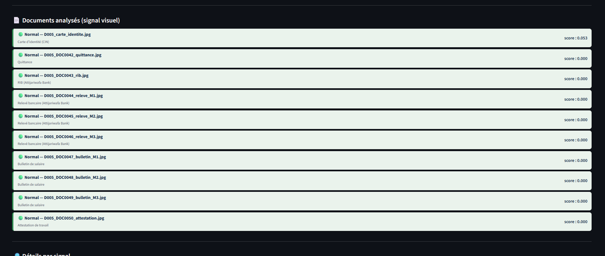 | 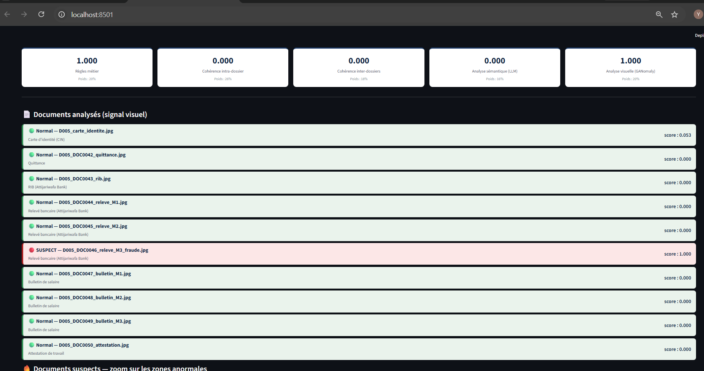 |
| 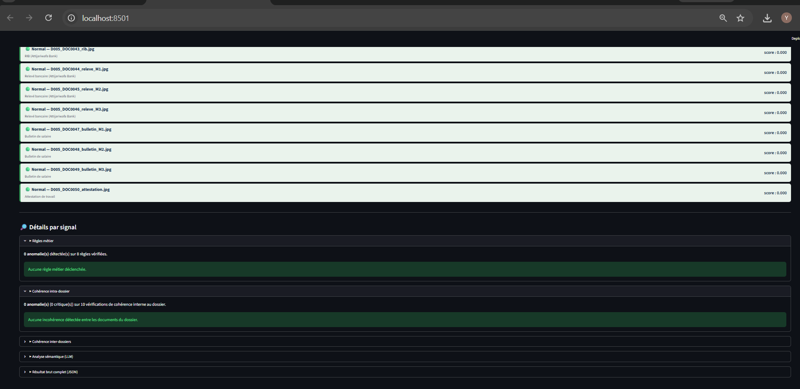 | 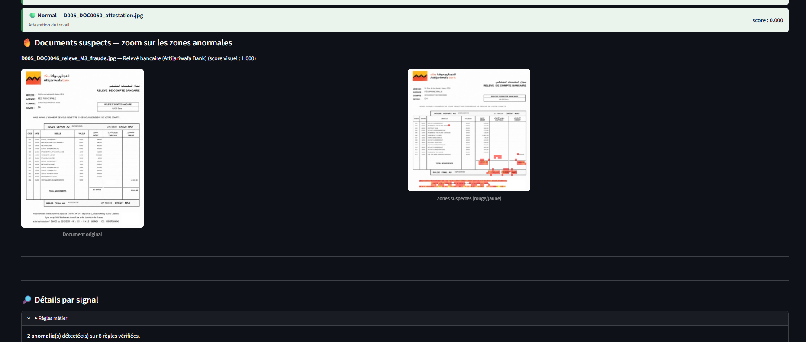 |
|  | 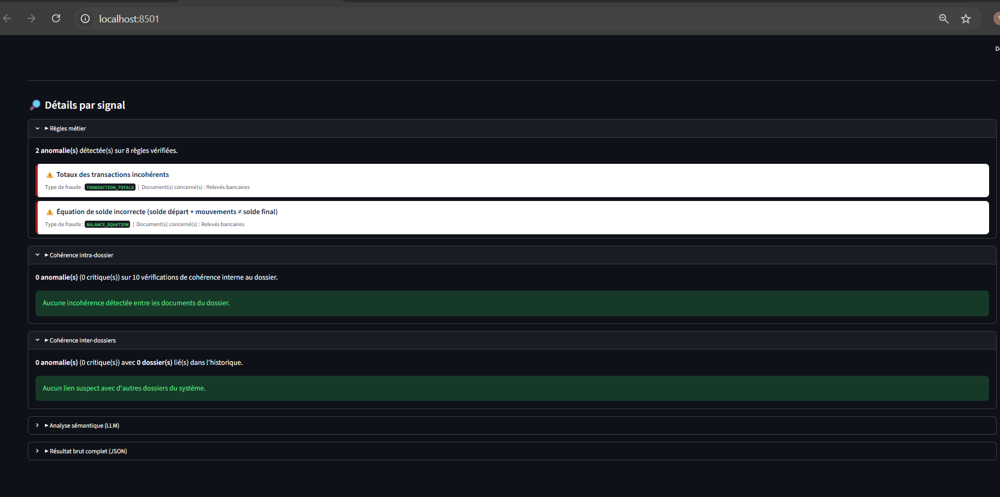 |

---

## 🗂️ Structure du dépôt

```
.
├── pipeline.py              # Orchestration complète (OCR → signaux → verdict)
├── streamlit_app.py         # Interface de démonstration
├── poids_calibration.json   # Poids de la régression logistique + seuils
├── ocr_extraction/          # OCR, classifieur de gabarits, extracteurs, normalisation, validation, dossier.json
├── graph/                   # Chargement des dossiers dans Neo4j
├── signals/                 # Les 5 détecteurs
│   └── visual_engine/models/   # Configs + calibration par type de document (checkpoints .pth à télécharger)
├── testing/                 # Tests, génération de fraudes synthétiques, calibration
├── data/                    # Caches OCR, JSON extraits/validés, signaux pré-calculés
├── requirements.txt
└── .env.example
```

---

## 🚀 Installation

### Prérequis

- Python 3.10+
- [Neo4j](https://neo4j.com/download/) en local (ou Docker)
- Une clé API [Groq](https://console.groq.com/)

### 1. Cloner et installer

```bash
git clone https://github.com/<votre-utilisateur>/<nom-du-repo>.git
cd <nom-du-repo>
python -m venv venv
source venv/bin/activate        # Windows : venv\Scripts\activate
pip install -r requirements.txt
```

### 2. Configurer l'environnement

```bash
cp .env.example .env
```

Renseigner dans `.env` les paramètres Neo4j (URI, utilisateur, mot de passe) et la clé `GROQ_API_KEY`.

### 3. Télécharger les modèles visuels (Hugging Face)

Les checkpoints GANomaly (`.pth`) sont volumineux et hébergés sur Hugging Face :

👉 **[https://huggingface.co/\<votre-utilisateur\>/\<nom-du-modele\>](https://huggingface.co/<votre-utilisateur>/<nom-du-modele>)**

```bash
pip install -U huggingface_hub
huggingface-cli download <votre-utilisateur>/<nom-du-modele> \
  --local-dir signals/visual_engine/models
```

Chaque dossier de gabarit doit contenir son `*.pth` à côté de `config.json` et `calibration.json`.

### 4. Lancer

```bash
streamlit run streamlit_app.py
```

Déposer les 10 documents d'un dossier, indiquer son identifiant, puis lancer l'analyse.

---

## 🧪 Choix de conception

- **Pas de supervision requise** pour le signal visuel : GANomaly n'apprend que la « normalité ».
- **Le LLM ne produit jamais de score** : seulement une liste d'anomalies, transformée en score par du code déterministe.
- **Score = maximum** pour les signaux Neo4j et visuel : une seule anomalie forte doit suffire à lever une alerte.
- **Régression logistique** plutôt qu'un modèle d'ensemble : poids interprétables, auditables en contexte bancaire.
- **Aide à la décision** : une alerte est un indicateur de suspicion, pas une preuve de fraude.

---

